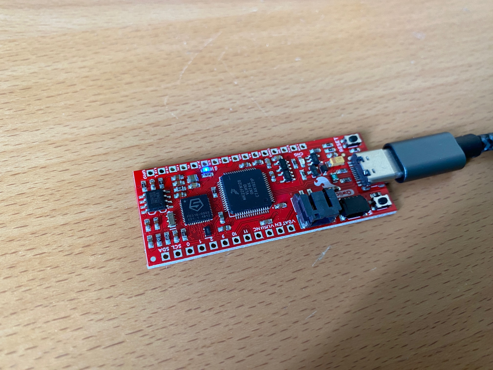

RED-V_SiFive_RISC-V_FE310_SoC
==================
Bare metal programming on the RED-V Thing Plus board (SiFive RISC-V FE310 SoC).

<p align="center">
    <a href="https://github.com/Embedded-System-Lovers/RED-V_SiFive_RISC-V_FE310_SoC/actions">
        </a>
    <a href="https://github.com/Embedded-System-Lovers/RED-V_SiFive_RISC-V_FE310_SoC/blob/main/LICENSE">
        </a>
</p>

This repository implements an entirely manually-written, pure
_bare_ _metal_ Blinky Project for the SiFive RISC-V FE310 SoC
(on the RED-V Thing Plus board).

Features include:
  - CPU, power, chip, clock and PLL initialization,
  - timebase derived from `mtimer`,
  - blinky LED show with adjustable frequency,
  - implementation in C99 with absolute minimal use of assembly.

Clear and easy-to-understand build systems based on either
GNUmake or CMake complete this fun and educational project.

This repository provides keen insight on starting up
a _bare_ _metal_ SiFive RISC-V controller. It emphasizes
simplicity and independence from monolithic toolchains
through its lightweight, self-written implementation.

## Details on the Application

The application boots from a tiny startup code in the boot ROM.

Following low-level chip initialization, the program jumps to
the `main()` subroutine. Here the timer interrupt is setup
for LED blinky.

The adjustable LED-phase (its half-period) can be tuned
to provide a rudimentary, visible blinky LED show.
The timebase for blinky is based on the `mtimer`
interrupt handler.

Blinky running on the target is shown in the image below.



## Building the Application

Build on `*nix*` is easy using `gcc-riscv32-unknown-elf`

Both Make and Cmake can be used to build the Application:

```sh
cd RED-V_SiFive_RISC-V_FE310_SoC
```
### Make
```sh
./Rebuild.sh
```
### CMake
```sh
mkdir Output && cd Output
cmake -DCMAKE_TOOLCHAIN_FILE=../cmake/toolchain-unix.cmake .. && make
```

The build results including ELF-file, HEX-mask, MAP-file
and assembly list file are created in the `Output`directory.

If `gcc-riscv32-unknown-elf` is not installed, it can easily
be obtained from [embecosm](https://www.embecosm.com/resources/tool-chain-downloads/#riscv-stable).
Add the path of the RISC-V GCC tools' bin folder to `$PATH`
in the usual `*nix` way.

## Continuous Integration

CI runs on pushes and pull-requests with simple
build(s) including result verification on `ubuntu-latest`
and `macos-latest` using GitHub Actions.

## Licensing

  - The source abd build code written for this repo is licensed under [_The_ _Unlicense_](./LICENSE).
  - Also the system-register file [`riscv-csr.h`](https://github.com/Embedded-System-Lovers/RED-V_SiFive_RISC-V_FE310_SoC/blob/master/Code/Mcal/riscv-csr.h), originally from [five-embedded](https://five-embeddev.com), is licenced under [_The_ _Unlicense_](./LICENSE).

